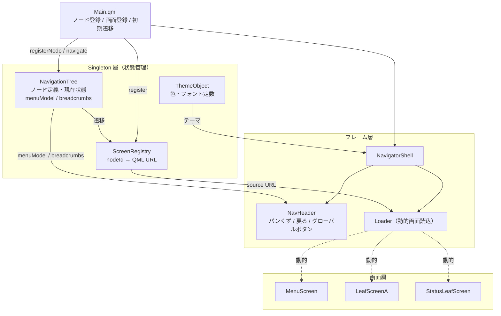

# qml-hmi-navigator

Qt 6 / QML で構築した汎用 HMI ナビゲーションフレームワーク。

産業用組込み UI のデザインパターン（グラフ構造ナビゲーション・一意性による（SSOT）ステート管理・`Loader` による遅延画面読み込み）をフルスクラッチで再実装したプロジェクトです。実稼働している組込み HMI アーキテクチャを示すポートフォリオとして公開しています。

## 機能

- **データ駆動ナビゲーション** — 画面遷移は UI コンポーネントにハードコードせず、グラフデータ（ノードとエッジ）として定義する
- **動的メニュー生成** — ナビゲーションツリーから実行時に子メニューを自動構築する
- **パンくずリスト追跡** — ルートから現在ノードまでのフルパスをナビゲーション状態と常に同期する
- **遅延画面読み込み** — `Loader` を使ってオンデマンドで画面を読み込み、メモリ使用量を最小限に抑える
- **Canvas 2D アイコン** — すべてのアイコンを Canvas 2D API で描画。PNG・SVG アセット不要
- **フォント内蔵** — MigMix 2P を同梱。システムフォントへの依存なし
- **800x480 ターゲット** — 小型産業用ディスプレイ向け設計。容易にカスタマイズ可能

## アーキテクチャ



### 設計思想

ナビゲーション構造を UI コンポーネントから切り離し、**名前付きノードのグラフ**として宣言します。`NavigationTree` Singleton は唯一の情報源（Single Source of Truth）として以下を管理します。

- 現在アクティブなノード
- 現在ノードの子ノード一覧（メニュー構築に使用）
- ルートから現在ノードまでのパンくずパス

画面コンポーネントは他の画面へ直接遷移しません。`NavigationTree.navigate(nodeId)` を呼び出すだけです。

### コンポーネント一覧

| コンポーネント | 役割 |
|---|---|
| `NavigationTree` | ナビゲーション状態マシン（Singleton） |
| `ScreenRegistry` | 画面パスレジストリ: nodeName → QML URL（Singleton） |
| `ThemeObject` | テーマ値: 色とフォント（Singleton） |
| `NavigatorShell` | ルートフレーム: NavHeader + Loader |
| `NavHeader` | パンくずバー・戻るボタン・グローバルアクションボタン |
| `HmiIcon` | Canvas 2D アイコン（`back`・`status`・`test`・`setting`・`arrow`） |
| `NavButton` | ナビゲーションリストボタン |
| `OnOffButton` | On/Off トグルボタン |

## ディレクトリ構成

```
qml-hmi-navigator/
├── CMakeLists.txt
├── main.cpp
├── qmldir
└── qml/
    ├── Main.qml
    ├── fonts/
    │   ├── migmix-2p-regular.ttf
    │   └── migmix-2p-bold.ttf
    ├── navigator/
    │   ├── NavigationTree.qml
    │   ├── ScreenRegistry.qml
    │   ├── NavigatorShell.qml
    │   └── NavHeader.qml
    ├── common/
    │   ├── ThemeObject.qml
    │   ├── HmiIcon.qml
    │   ├── NavButton.qml
    │   └── OnOffButton.qml
    └── screens/
        ├── MenuScreen.qml
        ├── LeafScreenA.qml
        └── StatusLeafScreen.qml
```

## 動作要件

- Qt 6.5 以降
- CMake 3.16 以降
- C++17 対応コンパイラ

## ビルド

```bash
cmake -S . -B build
cmake --build build
./build/qml-hmi-navigator
```

Windows で Qt MinGW ツールチェーンを使用する場合は、先に `CMAKE_PREFIX_PATH` を設定してください。

```bash
cmake -S . -B build -DCMAKE_PREFIX_PATH="C:/Qt/6.5.x/mingw_64"
cmake --build build
```

## 使い方

### ナビゲーショングラフの宣言

アプリケーションウィンドウ表示前に `Main.qml`（または任意の初期化エントリポイント）でノードを登録します。

```qml
Component.onCompleted: {
    // Register nodes: (id, parentId, label)
    NavigationTree.registerNode("root",       "",       "Home")
    NavigationTree.registerNode("status",     "root",   "Status")
    NavigationTree.registerNode("settings",   "root",   "Settings")

    // Register a numbered series of sibling nodes
    NavigationTree.registerRepeat("status_ope", "status", "Device", { from: 1, to: 4 })

    // Map node IDs to QML screens
    ScreenRegistry.register("root",     "qrc:/qml/screens/MenuScreen.qml")
    ScreenRegistry.register("status",   "qrc:/qml/screens/MenuScreen.qml")
    ScreenRegistry.register("settings", "qrc:/qml/screens/LeafScreenA.qml")

    // Navigate to the initial screen
    NavigationTree.navigate("root")
}
```

### 画面からの遷移

```qml
// Go to a specific node
NavigationTree.navigate("status")

// Go back to the parent node
NavigationTree.back()

// Move to the previous or next sibling node
NavigationTree.navigateSibling(-1)   // previous
NavigationTree.navigateSibling(+1)   // next
```

### メニューリストのバインディング

`NavigationTree.menuModel` は現在ノードの子を反映するリストモデルです。`Repeater` や `ListView` に直接バインドできます。

```qml
Repeater {
    model: NavigationTree.menuModel
    NavButton {
        label: modelData.label
        onClicked: NavigationTree.navigate(modelData.name)
    }
}
```

## API リファレンス

### NavigationTree（Singleton）

| メソッド / プロパティ | 型 | 説明 |
|---|---|---|
| `registerNode(id, parentId, label)` | function | 単一のナビゲーションノードを登録する |
| `registerRepeat(id, parentId, label, range)` | function | 連番ノードを一括登録する。`range` は `{ from: N, to: M }` |
| `navigate(nodeId)` | function | 指定ノードへ遷移する |
| `navigateSibling(delta)` | function | 隣接する兄弟ノードへ移動する（`+1` で次、`-1` で前） |
| `back()` | function | 親ノードへ戻る |
| `menuModel` | list property | 現在ノードの子一覧（各アイテムは `{ label, name }`） |
| `breadcrumbs` | list property | ルートから現在ノードまでの順序付きリスト（各アイテムは `{ label, name }`） |
| `currentNodeId` | string property | 現在アクティブなノードの ID |

### ScreenRegistry（Singleton）

| メソッド | 説明 |
|---|---|
| `register(nodeId, qmlUrl)` | ノード ID と QML ファイル URL を対応付ける |
| `resolve(nodeId)` | 指定ノード ID に対応する QML URL を返す |

## ライブデモ（PCのみ）

**[https://bonifatius8.github.io/qml-hmi-navigator/](https://bonifatius8.github.io/qml-hmi-navigator/)**

Qt for WebAssembly ビルド。GitHub Actions で自動デプロイ。

## ライセンス

MIT License. 詳細は [LICENSE](LICENSE) を参照してください。
