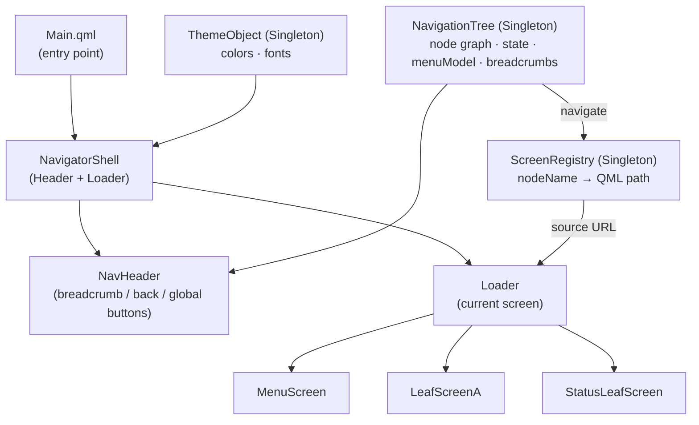

# qml-hmi-navigator

A general-purpose HMI navigation framework built with Qt 6 / QML.

This project re-implements industrial embedded UI design patterns from scratch — graph-structured navigation, Singleton state management, and lazy screen loading via `Loader`. It is intended as an open-source portfolio demonstrating real-world embedded HMI architecture.

## Features

- **Data-driven navigation** — Screen transitions are defined as graph data (nodes and edges), not hard-coded into UI components
- **Dynamic menu generation** — Child menus are built automatically from the navigation tree at runtime
- **Breadcrumb tracking** — Full path from root to current node, always in sync with navigation state
- **Lazy screen loading** — Screens are loaded on demand via `Loader`, keeping memory usage minimal
- **Canvas 2D icons** — All icons drawn with Canvas 2D API; no PNG or SVG assets required
- **Embedded font** — MigMix 2P bundled; no system font dependency
- **800x480 target** — Designed for small industrial displays; easily adaptable

## Architecture



### Design Philosophy

Navigation destinations are separated from UI components and declared as a **graph of named nodes**. The `NavigationTree` Singleton is the single source of truth for:

- Which node is currently active
- Which nodes are children of the current node (used to build menus)
- The breadcrumb path from root to current node

Screens never directly navigate to other screens. They only call `NavigationTree.navigate(nodeId)`.

### Component Overview

| Component | Role |
|---|---|
| `NavigationTree` | Navigation state machine (Singleton) |
| `ScreenRegistry` | Screen path registry: nodeName → QML URL (Singleton) |
| `ThemeObject` | Theme values: colors and fonts (Singleton) |
| `NavigatorShell` | Root frame: NavHeader + Loader |
| `NavHeader` | Breadcrumb bar, back button, global action buttons |
| `HmiIcon` | Canvas 2D icons (`back`, `status`, `test`, `setting`, `arrow`) |
| `NavButton` | Navigation list button |
| `OnOffButton` | On/Off toggle button |

## Directory Structure

```
qml-hmi-navigator/
├── CMakeLists.txt
├── main.cpp
├── qmldir
└── qml/
    ├── Main.qml
    ├── fonts/
    │   ├── migmix-2p-regular.ttf
    │   └── migmix-2p-bold.ttf
    ├── navigator/
    │   ├── NavigationTree.qml
    │   ├── ScreenRegistry.qml
    │   ├── NavigatorShell.qml
    │   └── NavHeader.qml
    ├── common/
    │   ├── ThemeObject.qml
    │   ├── HmiIcon.qml
    │   ├── NavButton.qml
    │   └── OnOffButton.qml
    └── screens/
        ├── MenuScreen.qml
        ├── LeafScreenA.qml
        └── StatusLeafScreen.qml
```

## Requirements

- Qt 6.5 or later
- CMake 3.16 or later
- A C++17-capable compiler

## Build

```bash
cmake -S . -B build
cmake --build build
./build/qml-hmi-navigator
```

On Windows with the Qt MinGW toolchain, set `CMAKE_PREFIX_PATH` first:

```bash
cmake -S . -B build -DCMAKE_PREFIX_PATH="C:/Qt/6.5.x/mingw_64"
cmake --build build
```

## Usage

### Declaring the Navigation Graph

Register nodes in `Main.qml` (or any initialization entry point) before the application window is shown:

```qml
Component.onCompleted: {
    // Register nodes: (id, parentId, label)
    NavigationTree.registerNode("root",       "",       "Home")
    NavigationTree.registerNode("status",     "root",   "Status")
    NavigationTree.registerNode("settings",   "root",   "Settings")

    // Register a numbered series of sibling nodes
    NavigationTree.registerRepeat("status_ope", "status", "Device", { from: 1, to: 4 })

    // Map node IDs to QML screens
    ScreenRegistry.register("root",     "qrc:/qml/screens/MenuScreen.qml")
    ScreenRegistry.register("status",   "qrc:/qml/screens/MenuScreen.qml")
    ScreenRegistry.register("settings", "qrc:/qml/screens/LeafScreenA.qml")

    // Navigate to the initial screen
    NavigationTree.navigate("root")
}
```

### Navigating from a Screen

```qml
// Go to a specific node
NavigationTree.navigate("status")

// Go back to the parent node
NavigationTree.back()

// Move to the previous or next sibling node
NavigationTree.navigateSibling(-1)   // previous
NavigationTree.navigateSibling(+1)   // next
```

### Binding the Menu List

`NavigationTree.menuModel` is a list model that reflects the children of the current node. Bind it directly to a `Repeater` or `ListView`:

```qml
Repeater {
    model: NavigationTree.menuModel
    NavButton {
        label: modelData.label
        onClicked: NavigationTree.navigate(modelData.name)
    }
}
```

## API Reference

### NavigationTree (Singleton)

| Method / Property | Type | Description |
|---|---|---|
| `registerNode(id, parentId, label)` | function | Register a single navigation node |
| `registerRepeat(id, parentId, label, range)` | function | Register a numbered series of nodes; `range` is `{ from: N, to: M }` |
| `navigate(nodeId)` | function | Navigate to the specified node |
| `navigateSibling(delta)` | function | Move to adjacent sibling (`+1` forward, `-1` backward) |
| `back()` | function | Navigate to the parent node |
| `menuModel` | list property | Children of the current node (`{ label, name }` per item) |
| `breadcrumbs` | list property | Ordered list from root to current node (`{ label, name }` per item) |
| `currentNodeId` | string property | ID of the currently active node |

### ScreenRegistry (Singleton)

| Method | Description |
|---|---|
| `register(nodeId, qmlUrl)` | Map a node ID to a QML file URL |
| `resolve(nodeId)` | Return the QML URL for the given node ID |

## Live Demo

Coming soon (Qt for WebAssembly)

## License

MIT License. See [LICENSE](LICENSE) for details.
